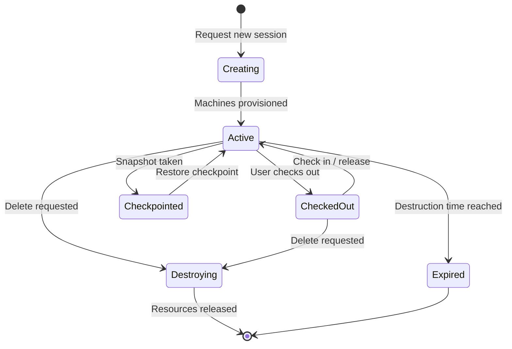

# Sessions

A **Session** is an isolated test environment consisting of one or more virtual machines. Sessions have a defined lifecycle: they are created, used for testing, checkpointed, and eventually destroyed.

---

## Session Lifecycle

---

## Viewing Sessions

Navigate to **Sessions** in the left sidebar. The page displays all sessions you have access to:

- **Active** — currently provisioned and usable
- **Checked Out** — in use by a team member
- **Expired** — past destruction deadline

Use the status filter chips at the top to narrow the list.

---

## Checkout a Session

Sessions in the **automation pool** (managed by `terraauto`) are available for checkout. Checking out a session assigns it to you, granting **Contributor** access to connect, run tasks, manage checkpoints, and control machines.

### How to Checkout

There are several ways to checkout a session:

**From the Sessions list:**

1. Find a session with the **Checkout** action available in its actions menu (⋯).
2. Click **Checkout** — the session is assigned to you immediately.

**From the Checkout Summary card:**

1. On the Sessions page, the **Checkout Available** card shows the number of pool sessions grouped by configuration.
2. Click the card to open the **Checkout Dialog**.
3. Select a session from the dropdown — sessions are grouped by config name and show remaining days.
4. Click **Checkout** to claim the session.

**From the Dashboard:**

- The dashboard stats section also provides access to the Checkout Dialog for quick checkout.

**From a Read-Only session view:**

- If you open a pool session you have **Reader** access to, a full-page prompt offers a **Checkout Session** button with a confirmation dialog.

### Session Quota

Each user has a **session quota** limiting how many sessions they can hold at once. The quota is tracked as:

- **Active** — sessions currently assigned to you
- **Pending** — sessions with pending assignment

If your total usage meets or exceeds the quota, checkout is blocked. A warning message will prompt you to **destroy or check in** existing sessions before checking out a new one.

The quota progress bar is visible in the **Checkout Summary** card.

### Checkout Rules

| Rule                 | Detail                                                                           |
| -------------------- | -------------------------------------------------------------------------------- |
| Who can checkout     | Any authenticated user, if the session is in the available pool and quota allows |
| Who can check in     | Only the session **owner** with **Contributor** permission                       |
| Already checked out  | Sessions assigned to another user do not show a Checkout option                  |
| Quota exceeded       | Checkout is blocked — destroy or check in sessions to free quota                 |
| Check in side effect | Restores default checkpoint, then reassigns to automation pool                   |

::: tip
The **Checkout** option only appears on sessions that are available in the pool. If you don't see it, the session is already assigned to someone else.
:::

---

## Connecting to a Machine

Each session contains one or more VMs. TerraForge provides remote access via **Azure Bastion** — a browser-based terminal embedded directly in the UI, with no VPN or public IP required.

See the full guide: [Connecting to a Machine](../guide/checkout-and-connect)

---

## Checkpoints and Restore

A checkpoint is a snapshot of all machine disk states within a session. You can create, restore, and delete checkpoints to manage your test environment state.

See the full guide: [Checkpoints and Restore](../guide/checkpoints)

---

## Check In (Release) a Session

Checking in returns a session to the available pool so others can use it.

1. Open the session actions menu (⋯) on a session you own.
2. Click **Check In**.
3. Confirm in the dialog — the system will:
   - **Restore the default checkpoint** (revert to a clean state)
   - **Reassign** the session back to the available pool

::: warning
Check in automatically restores the session's default checkpoint. Any changes made since the last checkpoint will be lost.
:::

---

## Delete Session

Deleting a session permanently destroys all virtual machines and associated resources. This action cannot be undone.

### How to Delete

1. Open the session actions menu (⋯) and click **Delete**.
2. A confirmation dialog appears. Read the warning carefully.
3. Click **Delete** to confirm.

### Requirements

- You must be the session **owner** with **Contributor** permission.
- The deletion request is processed **asynchronously** — the session is marked for destruction and resources are cleaned up in the background.

### What Gets Destroyed

- All virtual machines in the session
- All associated Azure resources (disks, NICs, bastion links)
- The session record is marked as deleted

After deletion, the session is immediately removed from your sessions list. If you were on the session detail page, you are redirected back to the Sessions list.

::: danger
Session deletion is irreversible. All machines, checkpoints, and data within the session will be permanently destroyed.
:::

---

## Session Expiry

Every session has a **destruction time** set at creation. When reached:

- The session will be automatically destroyed
- Resources are scheduled for cleanup

The time remaining is displayed on each session card.

**Default lifetime:** Sessions are automatically destroyed **60 days** after creation.

**Extending a session:**

- Extensions are available within the **last 30 days** before the destruction time
- Each extension adds up to **30 days** to the current destruction time
- To extend, open the session detail and click **Extend Days** in the expiry panel
