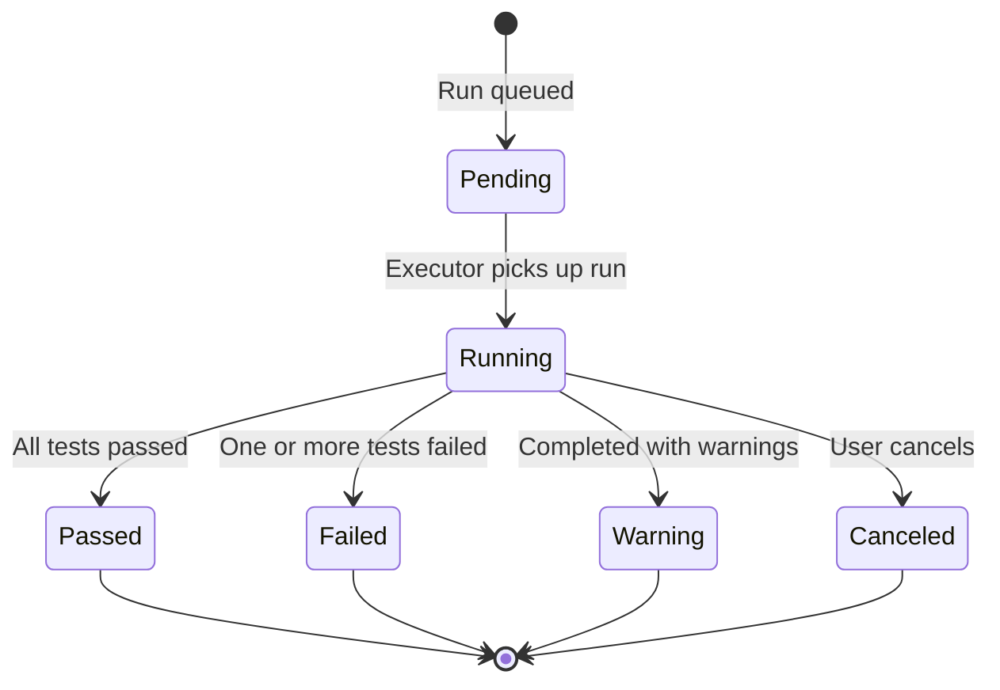

# Test Runs

## Overview

A **Test Run** executes a suite of automated tests against a specific session environment and records the results — including per-test-case outcomes, execution logs, and links back to the originating Azure DevOps build.

## Test Run Lifecycle

## The Test Run List

Navigate to **Test Runs** in the sidebar. The page opens filtered to **your runs from the last 5 days** by default.

Each row in the table shows:

| Column        | Description                                          |
| ------------- | ---------------------------------------------------- |
| **Status**    | Color-coded badge (see table below)                  |
| **Title**     | Descriptive name of the test run                     |
| **Product**   | Product under test — Publisher, Insights, or Catalog |
| **Version**   | Internal build version                               |
| **Branch**    | Source code branch                                   |
| **Queued By** | Who triggered the run                                |
| **Started**   | Relative time since the run started                  |

### Status Badges

| Badge        | Color | Meaning                          |
| ------------ | ----- | -------------------------------- |
| **Running**  | Blue  | Tests are actively executing     |
| **Passed**   | Green | All tests completed successfully |
| **Failed**   | Red   | One or more tests failed         |
| **Warning**  | Amber | Completed with warnings          |
| **Pending**  | Gray  | Queued, waiting to start         |
| **Canceled** | Gray  | Execution was manually stopped   |

## Filtering Test Runs

Click the **Search** button (labeled with the current active filter) to open the filter panel.

| Filter         | Description                                 |
| -------------- | ------------------------------------------- |
| **Date Range** | Set From / To dates to narrow the list      |
| **Status**     | Limit to Running, Passed, or Failed runs    |
| **Product**    | Filter by Publisher, Insights, or Catalog   |
| **Queued By**  | Show runs from a specific user or all users |

The button label summarises the active filters, for example: `Test Runs in Last 5 days · Failed · Publisher`.

Click **Reset** inside the panel to restore defaults (last 5 days, current user).

## Inspecting a Test Run

Click any row to open the **Detail Panel** on the right. The panel slides in without leaving the list.

### Panel Controls

| Control             | Action                                                               |
| ------------------- | -------------------------------------------------------------------- |
| **↗ open icon**     | Open the run in a dedicated full-page view (`/testruns/{id}/detail`) |
| **⤢ expand icon**   | Toggle fullscreen mode — covers the entire viewport                  |
| **✕ close icon**    | Close the panel and return to the full-width list                    |
| **Drag handle (⠿)** | Drag left/right to resize the panel width                            |

The panel can also be resized with **← / →** arrow keys when the drag handle is focused.

## Detail Panel — Summary Tab

The Summary tab shows an overview of the test run:

| Field                  | Description                          |
| ---------------------- | ------------------------------------ |
| **Status**             | Outcome badge                        |
| **Duration**           | Total execution time (e.g. `4m 32s`) |
| **Product**            | Product under test                   |
| **Version**            | Internal build version               |
| **Machine**            | Machine ID the run executed on       |
| **Queued By**          | Who triggered the run                |
| **Config**             | Session configuration name           |
| **Started / Finished** | Exact timestamps                     |

If the run originated from an Azure DevOps pipeline, a **View in Azure DevOps** link appears at the bottom of the summary, pointing directly to the originating build.

## Detail Panel — Test Results Tab

Displays individual test case outcomes parsed from `.trx` result files stored in Azure Blob Storage.

Each result row shows:

| Column            | Description                                                                |
| ----------------- | -------------------------------------------------------------------------- |
| **Result**        | Outcome badge — Passed / Failed / Error / Timeout / Inconclusive / Aborted |
| **Test Method**   | The test class and method name                                             |
| **Duration**      | Time taken for this individual test                                        |
| **Error Message** | Inline error details (visible for failed tests)                            |
| **Owner**         | Test case owner                                                            |
| **Category**      | Test category tag                                                          |

::: tip Catalog product runs
For **Catalog** product runs, results are rendered in a different format tailored to catalog-specific output. The experience is the same — click a row to expand error details.
:::

## Detail Panel — Logs Tab

> Available for Publisher and Insights runs only.

Displays all log files stored for this test run from Azure Blob Storage.

- Click a **log file row** to view its content inline.
- `.trx` files are rendered as a structured results viewer.
- Markdown (`.md`) files are rendered with formatting.
- Other file types are shown as plain text.
- Click **← Back to log files** to return to the file list.

## Full Detail Page

Opening a run via **↗ open in new page** gives the same Summary + Test Results + Logs tabs in a full-screen layout — ideal for focused investigation or sharing a direct URL with a teammate.

Route: `/testruns/{id}/detail`

## Video Recordings

For runs with screen capture enabled, a video recording of the test execution is accessible at `/testruns/{id}/video`. This is particularly useful for diagnosing UI test failures where the sequence of events on screen matters.
